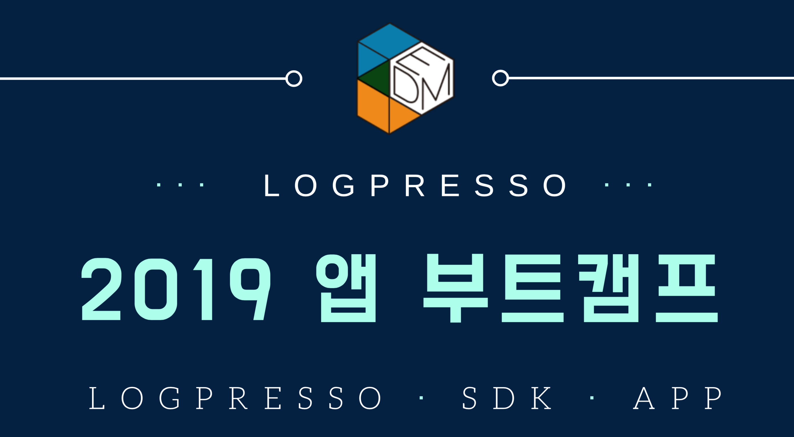

# 로그프레소 2019 앱 부트캠프

## 환영합니다! ##
로그프레소 앱 부트 캠프는 참가자들이 새롭게 만들어진 로그프레소 APP SDK를 사용하여 한번에 집중적으로 경험할 수 있도록 특강 형태의 교육을 수강합니다. 
주어진 개발 미션과 자유 주제 미션을 수행하면서 로그프레소 기반에서 빅데이터 솔루션을 개발하는 기술을 습득하게 됩니다.
로그프레소를 직접 개발하는 이디엄의 각 분야의 개발자들이 멘토가 되어 기존 교육과는 차별화된 새로운 기술 습득 경험과 케어를 제공합니다. 애플리케이션 소스 코드 및 실습 가이드는 Github Repository를 통해 제공됩니다.

### 일정
* 2019.11.27 ~ 2019.11.29

## Bootcamp GUIDES
* [step 0 - parser setting](bootcamp-guide/step0.md)
	
* [step 1 - 배우는 것들, createAppProject](bootcamp-guide/step1.md)

* [step 2 - manifest.json](bootcamp-guide/step2.md)

* [step 3 - Angular-cli, ng new](bootcamp-guide/step3.md)

* [step 4 - outputPath, base href](bootcamp-guide/step4.md)

* [step 5 - 로그프레소 메뉴에 앱 추가하기](bootcamp-guide/step5.md)

* [step 6 - eediom-sdk, material-cdk](bootcamp-guide/step6.md)

* [step 7 - tsconfig.json, package.json](bootcamp-guide/step7.md)

* [step 8 - app.module.ts, app.component.ts](bootcamp-guide/step8.md)

* [step 9 - app.component.html](bootcamp-guide/step9.md)

* [step 10 - maven build](bootcamp-guide/step10.md)

* [step 11 - 시나리오 기반 데이터 연동](bootcamp-guide/step11.md)
