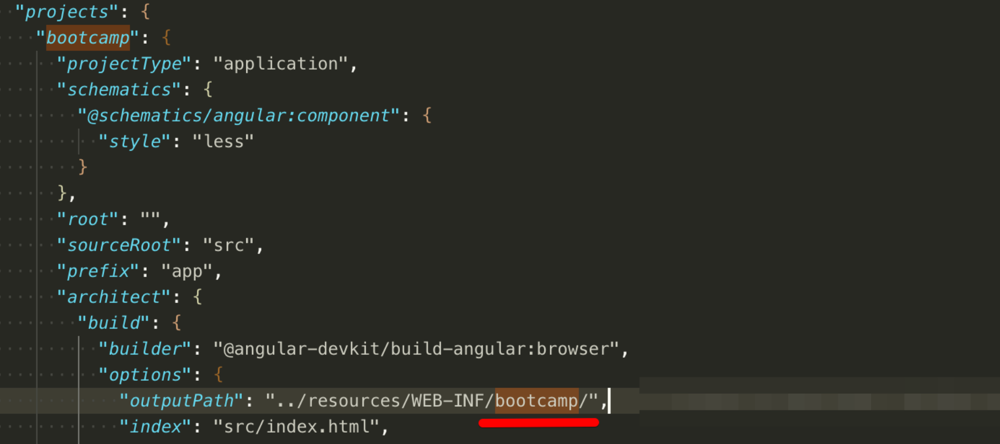
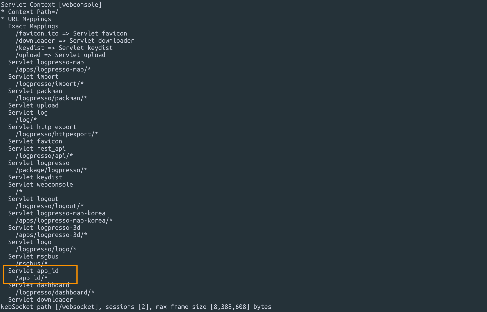

# bootcamp-2019

3597브랜치로 풀 빌드.
3597캐시 다운로드
run.sh복사
export JAVA_HOME=`/usr/libexec/java_home -v 9`
./run.sh
telnet localhost 7001
bundle.install com.google.code.gson gson 2.8.6
bundle.install commons-cli commons-cli 1.4
bundle.install file:///Users/mac/Documents/splunk-sdk-java-1.6.5.jar
bundle.refresh
bundle.start 000

logpresso.createAppProject
/Users/mac/Documents/bootcamp
com.logpresso.bootcamp
1.0
bootcamp
bootcamp
1.0
4.0
bootcamp
bootcamp
all,admin,member


 ~/documents/bootcamp/src/main/ng new bootcamp
angular.json 에서 "outputPath": "../resources/WEB-INF/bootcamp",

index.html   <base href="./">

logpresso.buildApp /Users/mac/Documents/bootcamp /Users/mac/Documents/bootcamp/bootcamp-1.0.0.jar
bundle.install file:///Users/mac/Documents/bootcamp/bootcamp-app-1.0.0.jar
bundle.refresh
bundle.start 000

pom.xml 파일 추가.
<project
	xsi:schemaLocation="http://maven.apache.org/POM/4.0.0 http://maven.apache.org/xsd/maven-4.0.0.xsd"
	xmlns="http://maven.apache.org/POM/4.0.0" xmlns:xsi="http://www.w3.org/2001/XMLSchema-instance">
	<modelVersion>4.0.0</modelVersion>
	<groupId>com.logpresso</groupId>
	<artifactId>bootcamp-app</artifactId>
	<version>1.0.0</version>
	<packaging>bundle</packaging>
	<name>Bootcamp App</name>
	<build>
		<plugins>
			<plugin>
				<groupId>org.apache.maven.plugins</groupId>
				<artifactId>maven-compiler-plugin</artifactId>
				<version>3.3</version>
				<configuration>
					<encoding>UTF-8</encoding>
					<source>8</source>
					<target>8</target>
					<debug>true</debug>
					<optimize>true</optimize>
					<showDeprecations>true</showDeprecations>
				</configuration>
			</plugin>
			<plugin>
				<groupId>org.apache.felix</groupId>
				<artifactId>maven-bundle-plugin</artifactId>
				<version>4.1.0</version>
				<extensions>true</extensions>
				<configuration>
					<instructions>
						<Bundle-SymbolicName>com.logpresso.bootcamp</Bundle-SymbolicName>						
						<Export-Package>
							com.logpresso.bootcamp.app,
							com.logpresso.bootcamp.msgbus
						</Export-Package>
						<Import-Package>
							*
						</Import-Package>
						<Private-Package>
							com.logpresso.bootcamp.command,
							com.logpresso.bootcamp.logger,
							com.logpresso.bootcamp.model,
							com.logpresso.bootcamp.parser,
							com.logpresso.bootcamp.script
						</Private-Package>
					</instructions>
				</configuration>
			</plugin>
			<plugin>
				<groupId>org.apache.felix</groupId>
				<artifactId>maven-ipojo-plugin</artifactId>
				<version>1.12.1</version>
				<executions>
					<execution>
						<goals>
							<goal>ipojo-bundle</goal>
						</goals>
					</execution>
				</executions>
			</plugin>
			<plugin>
				<groupId>com.github.eirslett</groupId>
				<artifactId>frontend-maven-plugin</artifactId>
				<version>1.6</version>
				<configuration>
					<workingDirectory>src/main/bootcamp</workingDirectory>
				</configuration>
				<executions>
					<execution>
						<id>install node and yarn</id>
						<goals>
							<goal>install-node-and-yarn</goal>
						</goals>
						<phase>pre-clean</phase>
						<configuration>
							<nodeVersion>v11.7.0</nodeVersion>
							<yarnVersion>v1.13.0</yarnVersion>
							<downloadRoot>http://staging.araqne.org/nodejs/dist/</downloadRoot>
						</configuration>
					</execution>
					<execution>
						<id>yarn install</id>
						<goals>
							<goal>yarn</goal>
						</goals>
						<configuration>
							<arguments>install --no-optional</arguments>
						</configuration>
					</execution>	
					<execution>
						<id>install dependencies</id>
						<goals>
							<goal>yarn</goal>
						</goals>
						<configuration>
							<arguments>install --ignore-optional --strict-ssl=false --ignore-scripts</arguments>
						</configuration>
					</execution>
					<execution>
						<id>build all</id>
						<goals>
							<goal>yarn</goal>
						</goals>
						<phase>generate-resources</phase>
						<configuration>
							<arguments>run build</arguments>
						</configuration>
					</execution>
				</executions>
			</plugin>
		</plugins>
	</build>
	<repositories>
		<repository>
			<id>splunk-artifactory</id>
			<name>Splunk Releases</name>
			<url>http://splunk.jfrog.io/splunk/ext-releases-local</url>
		</repository>
	</repositories>
	<dependencies>
		<dependency>
			<groupId>org.apache.felix</groupId>
			<artifactId>org.apache.felix.ipojo</artifactId>
			<version>1.10.1</version>
		</dependency>
		<dependency>
			<groupId>org.apache.felix</groupId>
			<artifactId>org.apache.felix.ipojo.annotations</artifactId>
			<version>1.10.1</version>
		</dependency>
		<dependency>
			<groupId>org.slf4j</groupId>
			<artifactId>slf4j-api</artifactId>
			<version>1.7.12</version>
		</dependency>
		<dependency>
			<groupId>org.slf4j</groupId>
			<artifactId>slf4j-simple</artifactId>
			<scope>test</scope>
			<version>1.7.12</version>
		</dependency>
		<dependency>
			<groupId>org.araqne</groupId>
			<artifactId>araqne-log-api</artifactId>
			<version>3.12.7</version>
		</dependency>
		<dependency>
			<groupId>org.araqne</groupId>
			<artifactId>araqne-logdb</artifactId>
			<version>3.9.1-1</version>
		</dependency>
		<dependency>
			<groupId>org.araqne</groupId>
			<artifactId>araqne-confdb</artifactId>
			<version>1.0.2</version>
		</dependency>
		<dependency>
			<groupId>com.splunk</groupId>
			<artifactId>splunk</artifactId>
			<version>1.6.5.0</version>
		</dependency>
		<dependency>
			<groupId>org.araqne</groupId>
			<artifactId>araqne-httpd</artifactId>
			<version>1.6.4</version>
		</dependency>
		<dependency>
			<groupId>org.araqne</groupId>
			<artifactId>araqne-msgbus</artifactId>
			<version>1.12.4</version>
		</dependency>		
		<dependency>
			<groupId>org.araqne</groupId>
			<artifactId>araqne-webconsole</artifactId>
			<version>3.18.1-1</version>
		</dependency>
		<dependency>
			<groupId>org.araqne</groupId>
			<artifactId>araqne-dom</artifactId>
			<version>3.5.4-2</version>
		</dependency>
	</dependencies>
</project>


tsconfig.json es5로 수정, ecma2015등 추가
{
  "compileOnSave": false,
  "compilerOptions": {
    "baseUrl": "./",
    "outDir": "./dist/out-tsc",
    "sourceMap": true,
    "declaration": false,
    "downlevelIteration": true,
    "experimentalDecorators": true,
    "module": "esnext",
    "moduleResolution": "node",
    "importHelpers": true,
    "target": "es5",
    "typeRoots": [
      "node_modules/@types"
    ],
    "lib": [
      "es2015",
      "es2016",
      "es2017",
      "es2018",
      "dom"
    ]
  },
  "angularCompilerOptions": {
    "preserveWhitespaces": true,
    "fullTemplateTypeCheck": true,
    "strictInjectionParameters": true
  }
}
package.json bin,script수정
  "bin": {
    "node": "node/node",
    "yarn": "node/yarn/dist/bin/yarn",
    "ng": "node/node node_modules/@angular/cli/bin/ng"
  },
  "scripts": {
    "ng": "ng",
    "start": "ng serve --base-href=/ --open",
    "build": "ng build --output-hashing=none --prod --build-optimizer=false",
    "test": "ng test",
    "lint": "ng lint",
    "e2e": "ng e2e",
  },
bootcamp/src/main/resources/manifest.json 붙여넣기.
루트 폴더에 splunk-sdk-java-1.6.5.jar 붙여넣기.
mvn install:install-file -DgroupId=com.splunk -DartifactId=splunk -Dversion=1.6.5.0 -Dpackaging=jar -Dfile=splunk-sdk-java-1.6.5.jar
bootcamp/src/main 에 java 폴더채 붙여넣기
/Users/mac/Documents/bootcamp/src/main/resources/metadata.xml 붙여넣기
mvn clean install
bundle.replace 115 file:///Users/mac/Documents/bootcamp/target/bootcamp-app-1.0.0.jar
bundle.refresh
bundle.start 113

bootcamp.createSplunkProfile
name?
Test
host?
172.20.34.2
port?
8089
user?
logpresso
password?

시스템설정에서 파서 추가.

bootcamp name=test  query="search index=github"  | parse event

## 1. Angular-cli 로 프로젝트 생성하기
앵귤러 cli는 프로젝트 생성부터 템플릿 자동생성, 개발 서버, 배포, 테스트 등을 지원합니다. 

이렇게 다양한 기능을 제공하는 앵귤러cli는 앵귤러 프로젝트를 진행하는데 필요한 만능 개발도구죠.

그럼 바로 설치해 보겠습니다. 터미널을 열고 다음 명령어를 입력합니다. 

	yarn global add @angular/cli

설치가 완료되면 이제 ng 명령어를 사용할 수 있는데요 다음 명령어로 설치된 앵귤러 버전을 확인할 수 있습니다. 현재 버전은 앵귤러8 버전이네요.

	ng --version


앵귤러 cli의 프로젝트 생성 명령은 `ng new` 입니다. 이를 이용해 프로젝트를 생성해 줍시다.

	ng new bootcamp

## 2. manifest.json 작성

이 파일은, 앞에서 우리가 생상한 앱이 실행될 때의 시작 파라미터와 기본값을 담고 있는데요

이 메타데이터를 json 기반으로 선언해 줍니다. 이를 통해 앱의 이름, 시작할때 열리게 되는 페이지 등을 지정할 수 있습니다. 
 
이 프로젝트에서는 다음과 같은 위치에 넣어줍니다.

>`/bootcamp-2019/bootcamp-app/src/main/resources/manifest.json`

```
{
	"required_version": "4.0",
	"app_version": "1.0.0",
	"bundle_symbolic_name": "com.logpresso.bootcamp",
	"app_names": {
		"ko": "bootcamp",
		"en": "bootcamp"
	},
	"programs": [
		{
			"program_names": {
				"ko": "program_names", //대메뉴에 추가되는 메뉴 이름
				"en": "bootcamp"
			},
			"program_id": "bootcamp",  //angular.json의  outputPath 폴더명
			"program_profiles": [
				"all",
				"admin",
				"member"
			]
		}
	],
	"app_id": "app_id", //서블렛에서 URL 맵핑
	"bundle_version": "1.0.0"
}
```

- `"program_names"` 은 대메뉴에 추가되는 메뉴 이름 부분입니다.
- `"program_id"` 는 아래 경로에 있는 angular.json의  outputPath 폴더명과 일치시켜 줍니다. 빌드 결과가 생성될 경로입니다.
- `"app_id"` 는 서블렛에서 URL 맵핑됩니다. 
>`/bootcamp-2019/bootcamp-app/src/main/ts/angular.json`



## 3. 앱을 빌드하고 로그프레소 대메뉴에 추가하기
이제 앞에서 생성한 앵귤러 프로젝트로 개발한 앱을 로그프레소 대메뉴에 추가해 보겠습니다.
1. 번들 jar파일 생성

	생성한 앵귤러 프로젝트를 빌드하여 번들 jar파일로 만들어 줍니다. 

	pom.xml 파일이 위차한 경로에서 빌드해 줍니다.

		mvn clean install

2. 빌드 후 생성된 번들 jar 파일을 install 해 줍니다.

		bundle.install file:///Users/sedan7001eediom.com/Documents/bootcamp-2019/bootcamp-app/target/bootcamp-app-1.0.0.jar


	아래 명령어를 입력하면 매핑된 URL을 확인할 수 있습니다.
	
		httpd.contexts

	

- 이제 브라우저를 열고 `localhost:8888` 주소를 입력해 봅시다. 

	대메뉴의 가장 오른쪽에 우리가 만든 앱이 추가된 것을 확인할 수 있죠? 

	현재 URL을 보시면 앞서 manifest.json에서 설정한 app_id/program_id 를 확인할 수 있습니다.

	


## 4. eediom-sdk, material-cdk 설치하기


### eediom-sdk

`$ yarn add https://github.com/logpresso/eediom-sdk.git#v1.0.5`: eediom에서 만든 sdk를 설치
 
### material-cdk

`$ yarn global add @angular/cli`: angular-cli를 설치
`$ ng add @angular/material`: [material-cdk](https://material.angular.io/guide/getting-started)를 설치

```
? Choose a prebuilt theme name, or "custom" for a custom theme: Indigo/Pink: 원하는 테마를 선택
? Set up HammerJS for gesture recognition?:  제스처 라이브러리 / YES or NO 둘다 괜찮음 
? Set up browser animations for Angular Material?: 머터리얼에 에니메이션을 추가할 수 있는데 그 기능에 대한 물음 / YES or NO 둘다 괜찮음
```

## 5. 새로운 라우트 페이지 만들기

### 라우트 분리

구현된 로직을 보면 route를 분리했습니다. 몇 가지 이유 때문에 그렇게 사용하고 있는데요

- app.component가 너무 무거워짐
- app.module을 관리하기 힘들어짐
- app.routing.module을 관리하기 힘들어짐

위의 이유로 라우터를 분리하여 구현하는 것을 선호합니다.

### 만들어 보기

`/src/pages`에 새로운 페이지를 추가하고 라우터에 해당 페이지를 링크 해보겠습니다.

#### 모듈 및 컴포넌트 생성

아래의 경로의 주의해주세요 아래는 `src/pages`에서 작업 중 입니다.
`ng g m index && ng g c index`

#### 모듈에 exports 추가

모듈 exports에 위에서 만든 `IndexComponent`를 추가해주세요

```
// index.module
@NgModule({
  declarations: [IndexComponent],
  exports: [IndexComponent],
})
```

#### routing.module에 해당 module및 라우팅 추가

```
export const routes: Routes = [
  {
    path: '',
    component: LayoutComponent,
    children: [
      { path: '', component: DashboardComponent }, 
      { path: 'settings', component: SettingsComponent }],
      { path: 'index', component: IndexComponent }], // indexComponent 추가
  },
];

@NgModule({
  imports: [CommonModule, RouterModule.forChild(routes), LayoutModule, DashboardModule, SettingsModule, IndexModule], //IndexModule 추가
  exports: [RouterModule],
})
```

## 6. 그리드 사용하기

[EEDIOM-SDK의 grid 예제 페이지](https://logpresso.github.io/eediom-sdk/?path=/story/grid-%EA%B7%B8%EB%A6%AC%EB%93%9C--plain) - notes로 설명을 볼 수 있습니다.
[Grid-wrapper.component](https://github.com/logpresso/bootcamp-2019/blob/master/bootcamp-app/src/main/ts/src/components/grid-wrapper/grid-wrapper.component.ts)

부트캠프 프로젝트에서는 그리드를 직접적으로 사용하지 않고 wapper를 사용하여 한번 더 묶어주는 것을 보실 수 있습니다. 그 이유로는

- 자주쓰는 옵션 미리 등록
- records가 없는 경우 처리

### 그리드에 데이터 보내기

`GridData` 타입으로 보내주셔아 합니다. *자세한 설명은 예제 페이지의 notes를 읽어주세요*

GridData 타입의 records를 넣어주시면 자동으로 해당 데이터를 기준으로 grid를 생성합니다.
