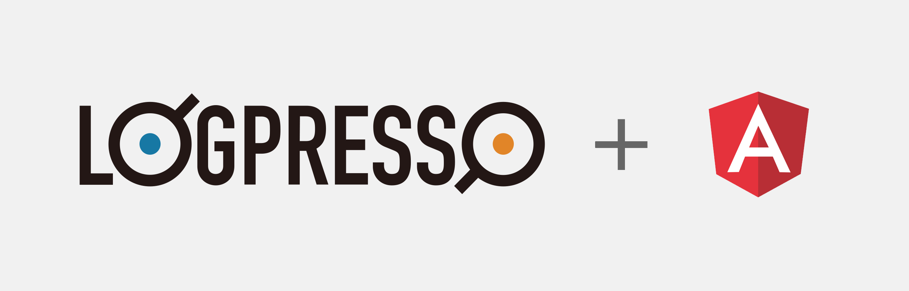

## step1 배우는 것들

- 애플리케이션 생성, 빌드, 로그프레소에 추가
- 프레임워크 앵귤러 8
	- 타입스크립트
	- 컴포넌트
	- 모듈
	- 템플릿
	- 라우터
	- 서비스
	- 컴포넌트 간 통신
- 튜토리얼 앱 만들기
- 시나리오 기반 데이터 앱에 연동
- 각각의 스텝마다 완성된 코드는 step1 ~ step10 git branch로 제공.

	https://github.com/logpresso/bootcamp-2019-base

---
### Bootcamp GUIDE LINKS
* ### [step 1 - 배우는 것들](step1.md)

* [step 2 - createAppProject](step2.md)

* [step 3 - Angular-cli로 프로젝트 생성, 빌드와 루트 path 설정](step3.md)

* [step 4 - 로그프레소 메뉴에 앱 추가하기](step4.md)

* [step 5 - eediom-sdk 설치, 타입스크립트 컴파일 설정](step5.md)

* [step 6 - 앵귤러 모듈과 컴포넌트](step6.md)

* [step 7 - 템플릿과 less를 활용한 스타일](step7.md)

* [step 8 - 전체 빌드후 앱에 시나리오 기반 데이터 연동](step8.md)

* [step 9 - 라우터 등록, 컴포넌트를 분리하고 라우팅 구현](step9.md)

* [step 10 - 서비스 구현, 컴포넌트간 값 전달.](step10.md)
