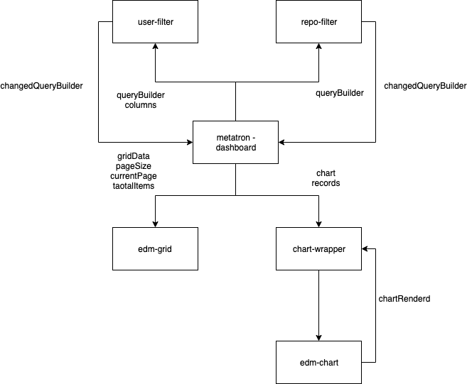

# Grid, Chart, Filter를 사용하여 대시보드 만들기

## 미리보기

## 구조

## 순서 

- [STEP1: metatron-dashboard 만들고 기본 구성 복사하기](./STEP1.md)
- [STEP2: dummy 파일 가져오고, dummy 파일을 queryResult로 parse하기](./STEP2.md)
- [STEP3: parse한 dummy 데이터를 edm-grid를 통해 보여주기](./STEP3.md)
- [STEP4-1: parse한 dummy 데이터를 edm-chart를 통해 보여주기 - chart-wrapper](./STEP4-1.md)
- [STEP4-2: parse한 dummy 데이터를 edm-chart를 통해 보여주기](./STEP4-2.md)
- [STEP5: 서버에 쿼리 날려보기](./STEP5.md)
- [STEP6: 쿼리에 대한 이해가 필요없는 필터](./STEP6.md)
- [STEP7: 쿼리에 대한 이해가 필요한 필터](./STEP7.md)
- [STEP8: 필터를 적용한 쿼리](./STEP8.md) 