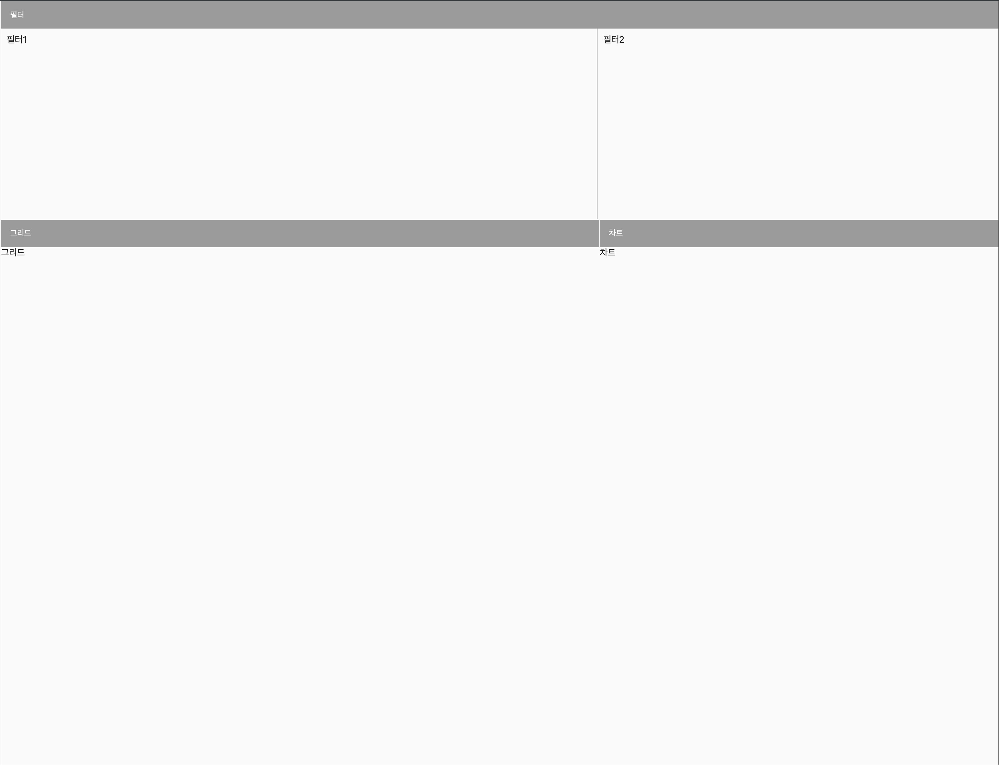

- 모듈과 컴포넌트 생성 - `ng g m metatron-dashboard && ng g c metatron-dashboard` 

- exports에 component 추가
```typescript
// metatron-dashboard.module.ts
import { CommonModule } from '@angular/common';
import { NgModule } from '@angular/core';
import { MatGridListModule } from '@angular/material/grid-list';
import { MetatronDashboardComponent } from './metatron-dashboard.component';

@NgModule({
	declarations: [ MetatronDashboardComponent ],
	imports: [ CommonModule, MatGridListModule ], // <-- 
	providers: [ ],
	exports: [ MetatronDashboardComponent ] // <--
})
export class MetatronDashboardModule {}
```

- material-grid에서 사용할 영역 잡기
```typescript
// metatron-dashboard.component.ts
import { Component, OnInit } from '@angular/core';
import { dummy } from './dummy';
import { environment } from '../../environments/environment';

@Component({
	selector: 'app-metatron-dashboard',
	templateUrl: './metatron-dashboard.component.html',
	styleUrls: [ './metatron-dashboard.component.less' ]
})
export class MetatronDashboardComponent implements OnInit {
	// <--
	tiles: Tile[] = [
		{ title: '필터', col: 5, row: 2, type: TileTypes.Filter },
		{
			title: '그리드',
			col: 3,
			row: 5,
			type: TileTypes.Grid
		},
		{ title: '차트', col: 2, row: 5, type: TileTypes.Chart }
	];
	// <--

	constructor() {}

	ngOnInit() {
	}
}

// <--
interface Tile {
	title: string;
	col: number;
	row: number;
	type: TileTypes;
}

enum TileTypes {
	Filter = 0,
	Grid,
	Chart
}
// <--
```


- template 복사하기
```html
<!-- metatron-dashboard.component.html -->
<mat-grid-list cols="5" rows="7" rowHeight="fit">
	<mat-grid-tile
			*ngFor="let tile of tiles"
			[colspan]="tile.col"
			[rowspan]="tile.row">
		<mat-grid-tile-header>
			{{tile.title}}
		</mat-grid-tile-header>
		<div class="mat-grid-tile-body">
			<ng-container [ngSwitch]="tile.type">
				<ng-template [ngSwitchCase]="0">
					<div class="filter-container">
						<div class="app-filter">
							필터1
							<!-- <app-user-filter [columns]="columns" [queryBuilder]="queryBuilder" (changedQueryBuilder)="onSearch(queryBuilder)"></app-user-filter> -->
						</div>
						<div class="repo-filter">
							필터2
							<!-- <app-repo-filter [queryBuilder]="queryBuilder" (changedQueryBuilder)="onSearch(queryBuilder)"></app-repo-filter> -->
						</div>
					</div>
				</ng-template>
				<ng-template [ngSwitchCase]="1">
					그리드
					<!-- <edm-grid [gridData]="gridData" [pageSize]="100" [currentPage]="currentPage" [totalItems]="count" (pageChanged)="onPage($event)"></edm-grid> -->
				</ng-template>
				<ng-template [ngSwitchCase]="2">
					차트
					<!-- <app-chart-wrapper [chart]="chart" [records]="records"></app-chart-wrapper> -->
				</ng-template>
			</ng-container>
		</div>
	</mat-grid-tile>
</mat-grid-list>
```


- less 스타일 복사하기 - 만약 보이지 않는다면 상위의 container의 height를 확인해보기
```less
// metatron-dashboard.component.less
.mat-grid-list {
	width: 100%;
	height: 100%;

	.mat-grid-tile-header {
		height: 24px;
		background: #4e5266;
	}
	.mat-grid-tile-body {
		position: relative;
		height: calc(100% - 24px);
		width: 100%;
		top: 12px;
		background: #e8eafa;
		color: #434b56;
		.filter-container {
			display: flex;
			height: 100%;

			div {
				height: 100%;
				padding: 10px;
			}

			.app-filter {
				width: 60%;
				border-right: 1px solid #cecece;
			}
			.repo-filter {
				width: 40%;
			}
		}
	}
}

```

---

