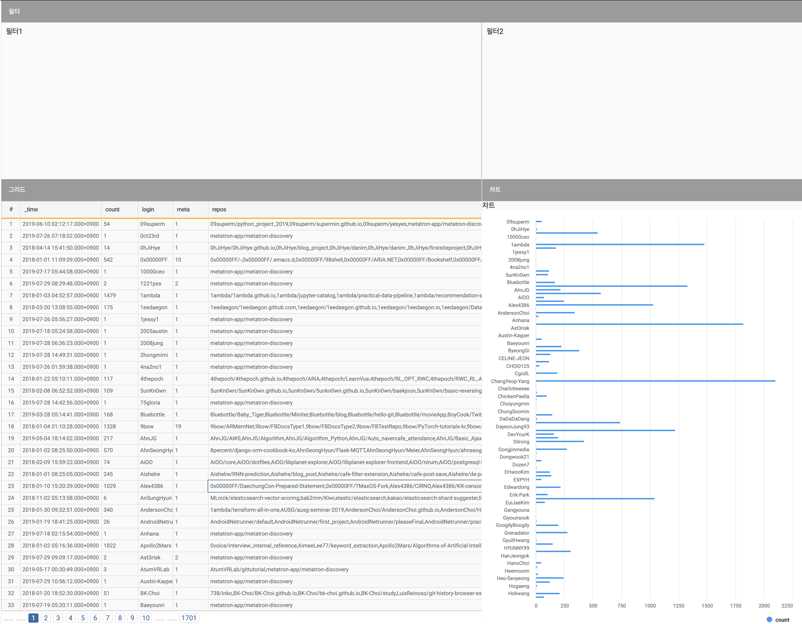

- chart-wrapper 주석 부분 해제
```html
<!-- metatron-dashboard.component.html -->
<mat-grid-list cols="5" rows="7" rowHeight="fit">
	<mat-grid-tile
			*ngFor="let tile of tiles"
			[colspan]="tile.col"
			[rowspan]="tile.row">
		<mat-grid-tile-header>
			{{tile.title}}
		</mat-grid-tile-header>
		<div class="mat-grid-tile-body">
			<ng-container [ngSwitch]="tile.type">
				<ng-template [ngSwitchCase]="0">
					<div class="filter-container">
						<div class="app-filter">
							필터1
							<!-- <app-user [columns]="columns" [queryBuilder]="queryBuilder" (changedQueryBuilder)="onSearch(queryBuilder)"></app-user> -->
						</div>
						<div class="repo-filter">
							필터2
							<!-- <app-metatron [queryBuilder]="queryBuilder" (changedQueryBuilder)="onSearch(queryBuilder)"></app-metatron> -->
						</div>
					</div>
				</ng-template>
				<ng-template [ngSwitchCase]="1">
					<edm-grid [gridData]="gridData" [pageSize]="100" [currentPage]="currentPage" [totalItems]="count" (pageChanged)="onPage($event)"></edm-grid>
				</ng-template>
				<ng-template [ngSwitchCase]="2">
					<app-chart-wrapper [chart]="chart" [records]="records"></app-chart-wrapper>
				</ng-template>
			</ng-container>
		</div>
	</mat-grid-tile>
</mat-grid-list>
```


- ChartWrapperModule을 imports에 추가

```typescript
// metatron-dashboard.module.ts
import { CommonModule } from '@angular/common';
import { NgModule } from '@angular/core';
import { MatGridListModule } from '@angular/material/grid-list';
import { GridModule } from 'eediom-sdk';
import { MetatronDashboardComponent } from './metatron-dashboard.component';
import { ChartWrapperModule } from '../chart-wrapper/chart-wrapper.module';

@NgModule({
	declarations: [ MetatronDashboardComponent ],
	imports: [ CommonModule, MatGridListModule, GridModule, ChartWrapperModule ], // <-- 
	providers: [ ],
	exports: [ MetatronDashboardComponent ]
})
export class MetatronDashboardModule {}
```


- chart객체를 만들고 원하는 차트 형태로 구현
```typescript
import { Component, OnInit } from '@angular/core';
import { dummy } from './dummy';
import { environment } from 'src/environments/environment';
import { QueryResult, GridData, ColumnTypes, Chart, ChartTypes, BarChartConfigs, Field } from 'eediom-sdk';

@Component({
	selector: 'app-metatron-dashboard',
	templateUrl: './metatron-dashboard.component.html',
	styleUrls: [ './metatron-dashboard.component.less' ]
})
export class MetatronDashboardComponent implements OnInit {
	tiles: Tile[] = [
		{ title: '필터', col: 5, row: 2, type: TileTypes.Filter },
		{
			title: '그리드',
			col: 3,
			row: 5,
			type: TileTypes.Grid
		},
		{ title: '차트', col: 2, row: 5, type: TileTypes.Chart }
	];

	queryResult: QueryResult;
	gridData: GridData;
	columns: ColumnTypes[];
	records: any[];
	count: number;

	chart: Chart; // <-- 

	currentPage: number = 1;
	pageSize: number = 100;

	constructor() {}

	ngOnInit() {
		// <--
		this.chart = new Chart(
			ChartTypes.Bar,
			new BarChartConfigs(new Field('login', 'string'), [ new Field('count', 'long') ], false)
		);
		// <--

		if (!environment.production) {
			this.queryResult = new QueryResult();
			this.queryResult.fieldTypes = QueryResult.parseFieldTypes(dummy.field_types);
			this.queryResult.count = dummy.count;
			setTimeout(() => {
				this.queryResult.records = dummy.result;
				this.gridData = new GridData({
					records: this.queryResult.records
				});
				this.columns = this.queryResult.fieldTypes;
				this.records = dummy.result;
				this.count = dummy.count;
			}, 2000);
		}
	}
}

interface Tile {
	title: string;
	col: number;
	row: number;
	type: TileTypes;
}

enum TileTypes {
	Filter = 0,
	Grid,
	Chart
}
```