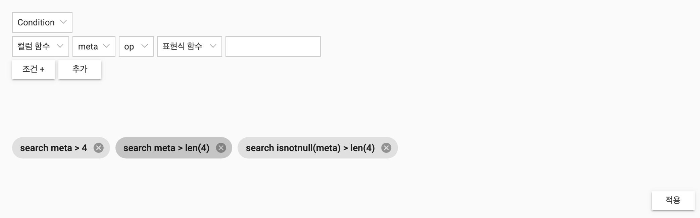

- 모듈과 컴포넌트 생성 `ng g m user-filter && ng g c user-filter`
- 필터1 부분 주석 제거

---




```typescript
// user-filter.module.ts
import { CommonModule } from '@angular/common';
import { NgModule } from '@angular/core';
import { FormsModule } from '@angular/forms';
import { MatButtonModule } from '@angular/material/button';
import { MatChipsModule } from '@angular/material/chips';
import { MatIconModule } from '@angular/material/icon';
import { InputModule, SelectModule } from 'eediom-sdk';

import { UserFilterComponent } from './user-filter.component';

@NgModule({
	declarations: [ UserFilterComponent ],
	imports: [ CommonModule, FormsModule, MatButtonModule, MatChipsModule, MatIconModule, SelectModule, InputModule ],
	exports: [ UserFilterComponent ]
})
export class UserFilterModule {}
```

```typescript
// user-filter.component.ts
import { Component, EventEmitter, Input, Output } from '@angular/core';
import {
	ColumnTypes,
	conditionQuery,
	customQuery,
	logicalConditions,
	logicalOpTypes,
	OpTypes,
	QueryBuilder,
	searchQuery,
	stringToEnum
} from 'eediom-sdk';

@Component({
	selector: 'app-user-filter',
	templateUrl: './user-filter.component.html',
	styleUrls: [ './user-filter.component.less' ]
})
export class UserFilterComponent {
	applyFilters: ApplyFilter[] = [];
	@Output() changedQueryBuilder: EventEmitter<QueryBuilder> = new EventEmitter<QueryBuilder>();
	@Input() queryBuilder: QueryBuilder;
	@Input()
	set columns(columns: ColumnTypes[]) {
		if (!columns) return;
		this.columnList = columns.map((column, idx) => ({ display: column.column, key: column.column }));
	}

	currentColumnFn: ItemList;
	currentColumn: ItemList;
	currentOperator: ItemList;
	currentExpressionFn: ItemList;
	currentExpression: ItemList;
	currentFilterType: ItemList;
	currentLogical: {
		exp: string;
		op: ItemList;
		fn: ItemList;
	}[] = [];
	custom: string;
	currentRepoType: string;

	columnList: ItemList[] = [];
	operatorList: ItemList[] = [];
	functionList: ItemList[] = [];
	filterList: ItemList[] = [];
	logicalList: ItemList[] = [];
	constructor() {
		this.operatorList = Object.keys(OpTypes).map((op) => ({
			display: OpTypes[op],
			key: op
		}));

		this.logicalList = Object.keys(logicalOpTypes).map((logical) => ({
			display: logicalOpTypes[logical],
			key: logical
		}));

		this.functionList = [
			{
				display: '지정 안함',
				key: null
			},
			{
				display: 'len',
				key: 'len'
			},
			{
				display: 'isnotnull',
				key: 'isnotnull'
			}
		];

		this.filterList = [
			{
				display: 'Condition',
				key: FilterTypes.Condition
			},
			{
				display: 'Logical',
				key: FilterTypes.Logical
			},
			{
				display: 'Custom',
				key: FilterTypes.Custom
			}
		];
	}

	addConditionFilter(columnFn: ItemList, column: ItemList, op: ItemList, expFn: ItemList, exp: any): void {
		const field = columnFn && columnFn.key !== null ? `${columnFn.display}(${column.display})` : column.display;
		const expField = expFn && expFn.key !== null ? `${expFn.display}(${exp})` : exp;
		const condition = conditionQuery(field, OpTypes[op.key], expField) + this.parseLogical();

		const pipe = this.queryBuilder.pipe(condition);

		this.applyFilters.push({
			display: condition,
			remove: pipe.remove,
			idx: this.applyFilters.length
		});
	}

	addLogicalFilter(): void {
		const condition = searchQuery(this.parseLogical());
		const pipe = this.queryBuilder.pipe(condition);

		this.applyFilters.push({
			display: condition,
			remove: pipe.remove,
			idx: this.applyFilters.length
		});
	}

	addCustomFilter(filter: string): void {
		const pipe = this.queryBuilder.pipe(customQuery(filter));

		this.applyFilters.push({
			display: filter,
			remove: pipe.remove,
			idx: this.applyFilters.length
		});
	}

	parseLogical(): string {
		if ((this.currentLogical || []).length === 0) return '';
		const logicalItemList = this.currentLogical.map((logical) => ({
			exp: logical.fn ? `${logical.fn.display}(${logical.exp})` : logical.exp,
			op: logical.op ? stringToEnum(logicalOpTypes, logical.op.key.toString()) : null
		}));

		return logicalConditions(logicalItemList);
	}

	remove(filter: ApplyFilter) {
		const idx = this.applyFilters.findIndex((applyFilter) => applyFilter.display === filter.display);

		if (idx < -1) return;

		this.applyFilters.splice(idx, 1);
	}

	onReset(): void {
		this.currentColumnFn = null;
		this.currentColumn = null;
		this.currentOperator = null;
		this.currentExpressionFn = null;
		this.currentExpression = null;
		this.currentLogical = [];
		this.custom = '';
	}

	onApply(): void {
		this.changedQueryBuilder.emit(this.queryBuilder);
	}
}

interface ItemList {
	display: string;
	key: number | string;
}

enum FilterTypes {
	Condition,
	Logical,
	Custom,
	Repos
}

interface ApplyFilter {
	display: string;
	remove: () => void;
	idx: number;
}
```

```html
<!-- user-filter.component.html -->
<div class="filter-container">
	<div class="filter-body">
		<div class="expression-container">
			<edm-select [itemList]="filterList" placeholder="필터 타입"  [(ngModel)]="currentFilterType" (valueChange)="onReset()"></edm-select>
			<div class="condition-filter" *ngIf="currentFilterType">
				<ng-container [ngSwitch]="currentFilterType.key">
					<ng-template [ngSwitchCase]="0">
						<div>
							<edm-select [itemList]="functionList" displayKey="display" placeholder="컬럼 함수" [(ngModel)]="currentColumnFn"></edm-select>
							<edm-select [itemList]="columnList" displayKey="display" placeholder="컬럼" [(ngModel)]="currentColumn"></edm-select>
							<edm-select [itemList]="operatorList" displayKey="display" placeholder="op" [(ngModel)]="currentOperator"></edm-select>
							<edm-select [itemList]="functionList" displayKey="display" placeholder="표현식 함수" [(ngModel)]="currentExpressionFn"></edm-select>
							<edm-input [(ngModel)]="currentExpression" type="text"></edm-input>
							<div>
								<ul>
									<li *ngFor="let logical of currentLogical; let idx = index">
										<edm-select [itemList]="logicalList" [(ngModel)]="currentLogical[idx].op" placeholder="논리 연산자"></edm-select>
										<edm-select [itemList]="functionList" displayKey="display" placeholder="표현식 함수" [(ngModel)]="currentLogical[idx].fn"></edm-select>
										<edm-input [(ngModel)]="currentLogical[idx].exp" placeholder="표현식"></edm-input>
									</li>
								</ul>
								<button mat-raised-button (click)="currentLogical.push({
									exp: '', op: null, fn: null
								})">조건 +</button>

								<button mat-raised-button (click)="addConditionFilter(currentColumnFn, currentColumn, currentOperator, currentExpressionFn, currentExpression)">추가</button>
							</div>
						</div>
					</ng-template>
					<ng-template [ngSwitchCase]="1">
						<div>
							<ng-container *ngFor="let logical of currentLogical; let idx = index">
								<edm-select [itemList]="logicalList" [(ngModel)]="currentLogical[idx].op" placeholder="논리 연산자" *ngIf="idx > 0"></edm-select>
								<edm-select [itemList]="functionList" displayKey="display" placeholder="표현식 함수" [(ngModel)]="currentLogical[idx].fn"></edm-select>
								<edm-input [(ngModel)]="currentLogical[idx].exp" placeholder="표현식"></edm-input>
							</ng-container>
							<button mat-raised-button (click)="currentLogical.push({
								exp: '', op: null, fn: null
							})">조건 +</button>
							<button mat-raised-button (click)="addLogicalFilter()">추가</button>
						</div>
					</ng-template>
					<ng-template [ngSwitchCase]="2">
						<div>
							<edm-input [(ngModel)]="custom" placeholder="쿼리를 입력하세요"></edm-input>
							<button mat-raised-button (click)="addCustomFilter(custom)">추가</button>
						</div>
					</ng-template>
				</ng-container>
			</div>
		</div>
	</div>
	<div class="filter-footer">
		<div class="apply-filter-container">
			<mat-chip-list>
				<mat-chip *ngFor="let applyFilter of applyFilters" (removed)="remove(applyFilter)">{{applyFilter.display}}
					<mat-icon matChipRemove>cancel</mat-icon>
				</mat-chip>
			</mat-chip-list>
		</div>
		<div class="search-container">
			<button mat-raised-button color="primary" (click)="onApply()">적용</button>
		</div>
	</div>
</div>
```

```less
.filter-container {
	width: 100%;
	height: 100%;

	* {
		box-sizing: border-box;
	}

	.filter-body {
		height: 70%;
		padding: 10px;
		overflow: auto;
	}

	.filter-footer {
		height: 30%;
		padding: 10px;
		position: relative;
		.search-container {
			position: absolute;
			bottom: 10px;
			right: 0;
		}
	}

	ul,
	li {
		padding: 0;
		margin: 5px 0;
		list-style: none;
	}

	.expression-container {
		margin-top: 5px;
		margin-bottom: 5px;
		edm-select + edm-select {
			margin-left: 5px;
		}

		edm-input {
			margin-left: 5px;
		}

		.condition-filter {
			margin-top: 5px;
		}
	}

	button + button {
		margin-left: 5px;
	}

	button {
		overflow: visible;
		color: #333;
		background: #fff;
		border-color: #cecece;
		line-height: 1.4;
		font-size: 13px;
		padding: 5px 7px;
		font-weight: 400;
		border-radius: 0;
	}
}
```