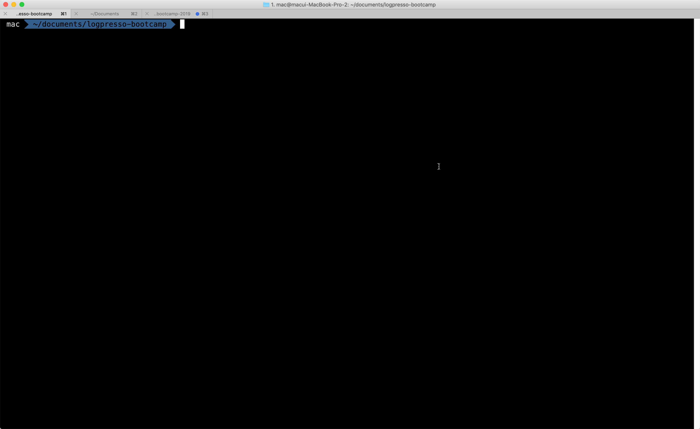

## step 1 ~ step 11
- 애플리케이션 생성, 빌드
- 앱을 로그프레소에 추가
- 앵귤러 8.0
- 시나리오 기반 데이터 연동
- step1 ~ step11 git branch

## step 1. createAppProject

- logpresso.createAppProject
	```
	telnet localhost 7008
	Trying ::1...
	telnet: connect to address ::1: Connection refused
	Trying 127.0.0.1...
	Connected to localhost.
	Escape character is '^]'.
	login as: root
	password:

	Please change the default password.
	New password:
	Retype password:
	Password changed successfully.

	Logpresso 3.9.1.1 (build 20191029) on Araqne Core 3.4.5
	``` 

	```
	logpresso.createAppProject
	Project path? /Users/mac/Documents/bootcamp-2019/bootcamp-app
	Bundle Symbolic Name? com.logpresso.bootcamp
	Bundle Version? 1.0
	App ID? bootcamp
	App Name? bootcamp
	App Version? 1.0
	Required Version (empty line to default version 3.0)?4.0
	Program ID (empty line to exit)? bootcamp
	Program Display Name? bootcamp
	Program Profiles? all,admin,member
	Program ID (empty line to exit)?
	```
	

---
### Bootcamp GUIDE LINKS
* [step 0 - parser setting](step0.md)
	
* [step 1 - createAppProject](step1.md)

* [step 2 - manifest.json](step2.md)

* [step 3 - Angular-cli, ng new](step3.md)

* [step 4 - outputPath, base href](step4.md)

* [step 5 - 로그프레소 메뉴에 앱 추가하기](step5.md)

* [step 6 - eediom-sdk, material-cdk](step6.md)

* [step 7 - tsconfig.json, package.json](step7.md)

* [step 8 - app.module.ts, app.component.ts](step8.md)

* [step 9 - app.component.html](step9.md)

* [step 10 - maven build](step10.md)

* [step 11 - 시나리오 기반 데이터 연동](step11.md)