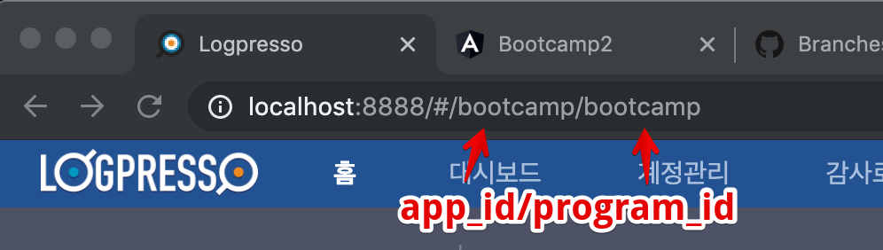
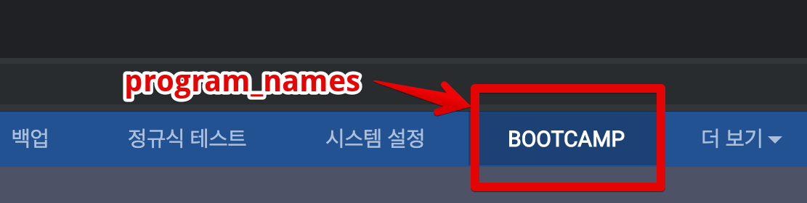

## step 2. createAppProject

### 2-1. 강의용 캐시 경로에서 sh ./run.sh

### 2-2. araqne console 접속
- telnet, ssh등으로 접속.


	>`araqne console`


	```bash
	telnet localhost 7008
	Trying ::1...
	telnet: connect to address ::1: Connection refused
	Trying 127.0.0.1...
	Connected to localhost.
	Escape character is '^]'.
	login as: root
	password: araqne

	Please change the default password.
	New password:
	Retype password:
	Password changed successfully.

	Logpresso 3.9.1.1 (build 20191029) on Araqne Core 3.4.5
	``` 

### 2-3. logpresso.createAppProject
- 앱이 실행될 때 필요한 시작 파라미터와 같은 기본값 설정
	>`araqne console`

	```
	logpresso.createAppProject
	Project path? /Users/mac/Documents/bootcamp-2019-base/bootcamp-app
	Bundle Symbolic Name? com.logpresso.bootcamp
	Bundle Version? 1.0
	App ID? bootcamp
	App Name? bootcamp
	App Version? 1.0
	Required Version (empty line to default version 3.0)?4.0
	Program ID (empty line to exit)? bootcamp
	Program Display Name? bootcamp
	Program Profiles? all,admin,member
	Program ID (empty line to exit)?
	```
	
	
	
- bootcamp-app 폴더에 생성된 `manifest.json` 파일을 아래 경로로 복사.

	>`/bootcamp-2019/bootcamp-app/src/main/resources/manifest.json`

	```json
	{
		"required_version": "4.0",
		"app_version": "1.0.0",
		"bundle_symbolic_name": "com.logpresso.bootcamp",
		"app_names": {
			"ko": "bootcamp",
			"en": "bootcamp"
		},
		"programs": [
			{
				"program_names": {
					"ko": "bootcamp",  //대메뉴에 추가되는 메뉴명
					"en": "bootcamp"  
				},
				"program_id": "bootcamp",  //angular.json의 outputPath
				"program_profiles": [
					"all",
					"admin",
					"member"
				]
			}
		],
		"app_id": "bootcamp",  //서블릿에서 url맵핑
		"bundle_version": "1.0.0"
	}
	```
---
### Bootcamp GUIDE LINKS
* [step 1 - 배우는 것들](step1.md)

* ### [step 2 - createAppProject](step2.md)

* [step 3 - Angular-cli로 프로젝트 생성, 빌드와 루트 path 설정](step3.md)

* [step 4 - 로그프레소 메뉴에 앱 추가하기](step4.md)

* [step 5 - eediom-sdk 설치, 타입스크립트 컴파일 설정](step5.md)

* [step 6 - 앵귤러 모듈과 컴포넌트](step6.md)

* [step 7 - 템플릿과 less를 활용한 스타일](step7.md)

* [step 8 - 전체 빌드후 앱에 시나리오 기반 데이터 연동](step8.md)

* [step 9 - 라우터 등록, 컴포넌트를 분리하고 라우팅 구현](step9.md)

* [step 10 - 서비스 구현, 컴포넌트간 값 전달.](step10.md)
