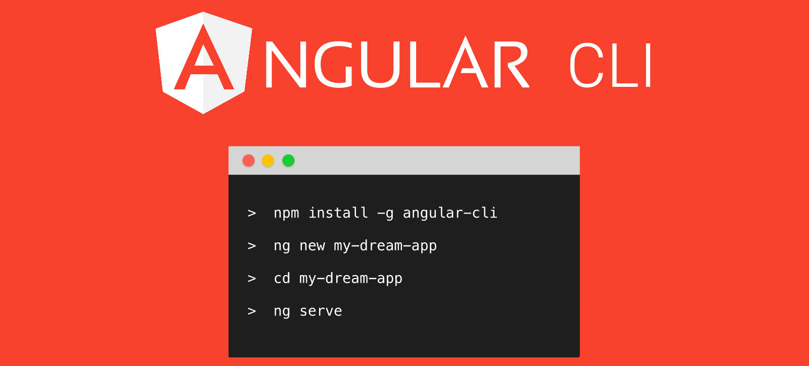
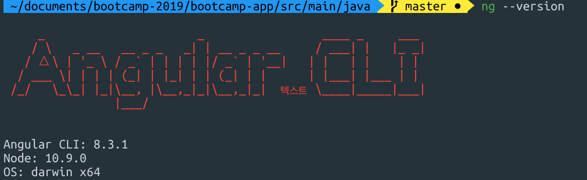
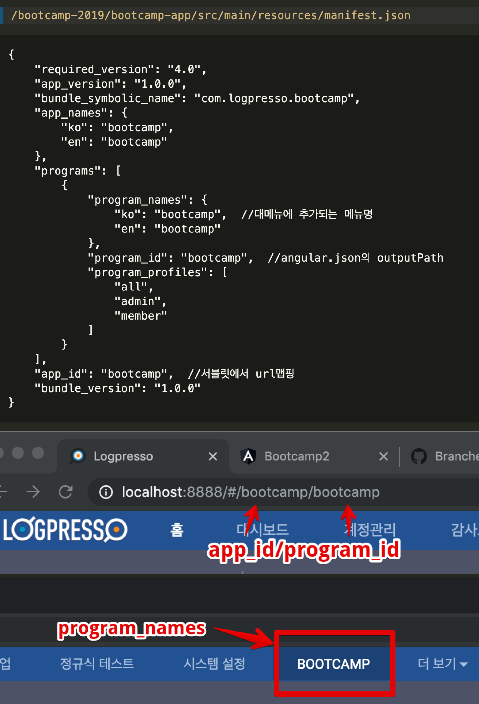

## step 3. Angular-cli로 프로젝트 생성, 빌드와 루트 path 설정

### 3-1. Angular-cli 로 프로젝트 생성

- Angular-cli 는 프로젝트 생성, 템플릿 자동생성, 개발서버, 테스트 등을 지원

	```bash
	$ yarn global add @angular/cli
	```

- ng 명령어

	```bash
	$ ng --version
	```

	

- 프로젝트 생성

	
	>`/bootcamp-2019-base/bootcamp-app/src/main/`
	```bash
	ng new bootcamp
	? Would you like to add Angular routing? Yes
	? Which stylesheet format would you like to use? Less
	```
	
### 3-2. angular 빌드 경로

- angular.json 수정

- 폴더명은 step2에서 지정한 program_id

	>`/bootcamp-2019-base/bootcamp-app/src/main/bootcamp/angular.json`
	```
	"outputPath": "../resources/WEB-INF/bootcamp",
	```
	
	
### 3-3 절대경로 수정.
- index.html

- 로그프레소에서 인식하는 루트경로
	
	>`/bootcamp-2019-base/bootcamp-app/src/main/bootcamp/src/index.html`
	```html
	<base href="./">
	```
---
### Bootcamp GUIDE LINKS
* [step 1 - 배우는 것들](step1.md)

* [step 2 - createAppProject](step2.md)

* ### [step 3 - Angular-cli로 프로젝트 생성, 빌드와 루트 path 설정](step3.md)

* [step 4 - 로그프레소 메뉴에 앱 추가하기](step4.md)

* [step 5 - eediom-sdk 설치, 타입스크립트 컴파일 설정](step5.md)

* [step 6 - 앵귤러 모듈과 컴포넌트](step6.md)

* [step 7 - 템플릿과 less를 활용한 스타일](step7.md)

* [step 8 - 전체 빌드후 앱에 시나리오 기반 데이터 연동](step8.md)

* [step 9 - 라우터 등록, 컴포넌트를 분리하고 라우팅 구현](step9.md)

* [step 10 - 서비스 구현, 컴포넌트간 값 전달.](step10.md)
