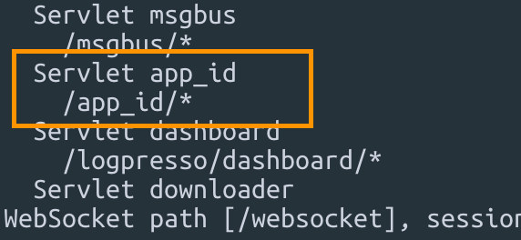
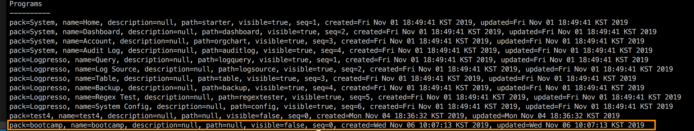
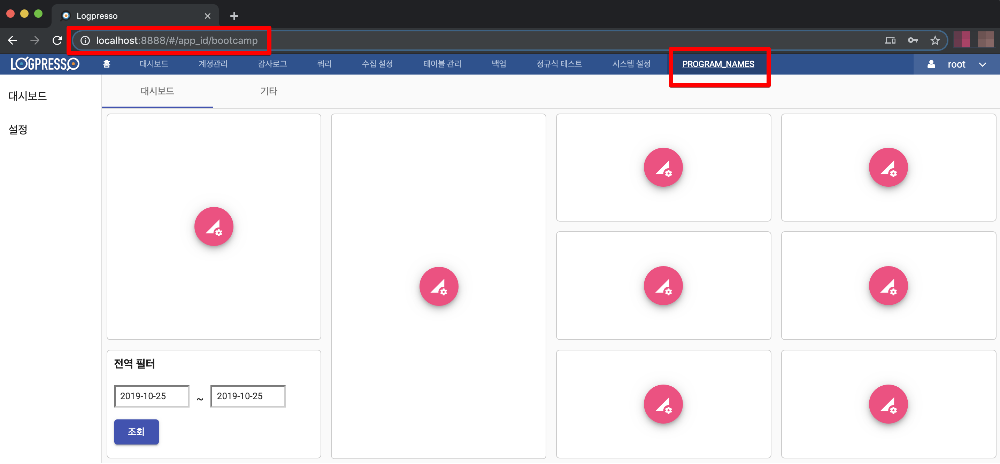

## step 5. 빌드, 로그프레소 메뉴에 앱 추가하기

- ng build

	>`/bootcamp-2019/bootcamp-app/src/main/bootcamp/`
	```
	ng build
	```

- buildApp
	
	```
	logpresso.buildApp /Users/mac/Documents/bootcamp-2019/bootcamp-app /Users/mac/Documents/bootcamp-2019/bootcamp-app/bootcamp-app-1.0.0.jar
	bundle.install file:///Users/mac/Documents/bootcamp-2019/bootcamp-app/bootcamp-app-1.0.0.jar
	bundle.refresh
	bundle.start 113
	```

- 맵핑된 URL

	```
	httpd.contexts
	```
	

- 등록된 프로그램

	```
	dom.programs localhost
	```
	

- 메뉴에 추가된 앱 확인.

	```
	localhost:8888
	```
	

---
### Bootcamp GUIDE LINKS
* [step 0 - parser setting](step0.md)
	
* [step 1 - createAppProject](step1.md)

* [step 2 - manifest.json](step2.md)

* [step 3 - Angular-cli, ng new](step3.md)

* [step 4 - outputPath, base href](step4.md)

* [step 5 - 로그프레소 메뉴에 앱 추가하기](step5.md)

* [step 6 - eediom-sdk, material-cdk](step6.md)

* [step 7 - tsconfig.json, package.json](step7.md)

* [step 8 - app.module.ts, app.component.ts](step8.md)

* [step 9 - app.component.html](step9.md)

* [step 10 - maven build](step10.md)

* [step 11 - 시나리오 기반 데이터 연동](step11.md)