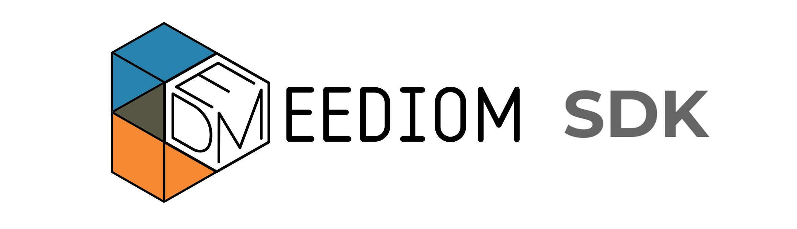

## step 5. eediom-sdk

### 5-1. eediom-sdk

- 시나리오 기반 데이터 연동에 필요한 부분
	
	>`/bootcamp-2019-base/bootcamp-app/src/main/bootcamp/`

	```
	$ yarn add file:../resources/eediom-sdk-1.0.6.tgz
	```
### 5-2. tsconfig.json

- lib속성: 개발시 지원하는 ecma스크립트
- target속성: 컴파일된 후의 버전

	>`/bootcamp-2019-base/bootcamp-app/src/main/bootcamp/tsconfig.json`


	```
	{
		"compileOnSave": false,
		"compilerOptions": {
			"baseUrl": "./",
			"outDir": "./dist/out-tsc",
			"sourceMap": true,
			"declaration": false,
			"downlevelIteration": true,
			"experimentalDecorators": true,
			"module": "esnext",
			"moduleResolution": "node",
			"importHelpers": true,
			"target": "es5",
			"typeRoots": [
			"node_modules/@types"
			],
			"lib": [
			"es2015",
			"es2016",
			"es2017",
			"es2018",
			"dom"
			]
		},
		"angularCompilerOptions": {
			"preserveWhitespaces": true,
			"fullTemplateTypeCheck": true,
			"strictInjectionParameters": true
		}
	}
	```

### 5-3. package.json

- bin, script 수정.

	>`/bootcamp-2019/bootcamp-app/src/main/bootcamp/package.json`

	```
	{
		"name": "bootcamp",
		"version": "0.0.0",
		"scripts": {
			"ng": "ng",
			"start": "ng serve --base-href=/ --open",
			"build": "ng build --output-hashing=none --prod --build-optimizer=false",
			"test": "ng test",
			"lint": "ng lint",
			"e2e": "ng e2e"
		},
		"private": true,
		"dependencies": {
			"@angular/animations": "~8.2.11",
			"@angular/cdk": "~8.2.3",
			"@angular/common": "~8.2.11",
			"@angular/compiler": "~8.2.11",
			"@angular/core": "~8.2.11",
			"@angular/forms": "~8.2.11",
			"@angular/material": "^8.2.3",
			"@angular/platform-browser": "~8.2.11",
			"@angular/platform-browser-dynamic": "~8.2.11",
			"@angular/router": "~8.2.11",
			"eediom-sdk": "https://github.com/logpresso/eediom-sdk.git#v1.0.6",
			"hammerjs": "^2.0.8",
			"rxjs": "~6.4.0",
			"tslib": "^1.10.0",
			"zone.js": "~0.9.1"
		},
		"devDependencies": {
			"@angular-devkit/build-angular": "~0.803.14",
			"@angular/cli": "~8.3.14",
			"@angular/compiler-cli": "~8.2.11",
			"@angular/language-service": "~8.2.11",
			"@types/jasmine": "~3.3.8",
			"@types/jasminewd2": "~2.0.3",
			"@types/node": "~8.9.4",
			"codelyzer": "^5.0.0",
			"jasmine-core": "~3.4.0",
			"jasmine-spec-reporter": "~4.2.1",
			"karma": "~4.1.0",
			"karma-chrome-launcher": "~2.2.0",
			"karma-coverage-istanbul-reporter": "~2.0.1",
			"karma-jasmine": "~2.0.1",
			"karma-jasmine-html-reporter": "^1.4.0",
			"protractor": "~5.4.0",
			"ts-node": "~7.0.0",
			"tslint": "~5.15.0",
			"typescript": "~3.5.3"
		}
	}
	```
### 5-4. package-lock.json 제거

- npm이 아닌 yarn으로 빌드하기 때문에 파일을 제거.
	
	>`/bootcamp-2019/bootcamp-app/src/main/bootcamp/package-lock.json`


---
### Bootcamp GUIDE LINKS
* [step 1 - 배우는 것들](step1.md)

* [step 2 - createAppProject](step2.md)

* [step 3 - Angular-cli로 프로젝트 생성, 빌드와 루트 path 설정](step3.md)

* [step 4 - 로그프레소 메뉴에 앱 추가하기](step4.md)

* ### [step 5 - eediom-sdk 설치, 타입스크립트 컴파일 설정](step5.md)

* [step 6 - 앵귤러 모듈과 컴포넌트](step6.md)

* [step 7 - 템플릿과 less를 활용한 스타일](step7.md)

* [step 8 - 전체 빌드후 앱에 시나리오 기반 데이터 연동](step8.md)

* [step 9 - 라우터 등록, 컴포넌트를 분리하고 라우팅 구현](step9.md)

* [step 10 - 서비스 구현, 컴포넌트간 값 전달.](step10.md)
