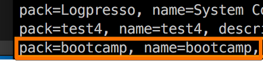

## 5. 빌드, 로그프레소 대메뉴에 추가하기

- ng build

	>`/bootcamp-2019/bootcamp-app/src/main/bootcamp/`
	```
	ng build
	```

- buildApp
	
	```
	logpresso.buildApp /Users/mac/Documents/bootcamp-2019/bootcamp-app /Users/mac/Documents/bootcamp-2019/bootcamp-app/bootcamp-app-1.0.0.jar
	bundle.install file:///Users/mac/Documents/bootcamp-2019/bootcamp-app/bootcamp-app-1.0.0.jar
	bundle.refresh
	bundle.start 113
	```

- 맵핑된 URL

	```
	httpd.contexts
	```
	

- 등록된 프로그램

	```
	dom.programs localhost
	```
	

- 메뉴에 추가된 앱 확인.

	```
	localhost:8888
	```
	
