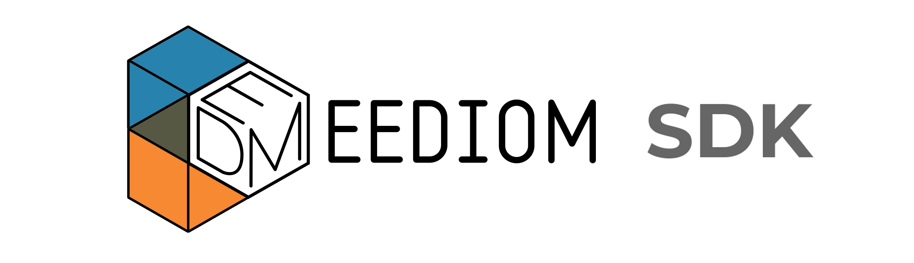

## step 6. eediom-sdk, material-cdk

- eediom-sdk

	시나리오 기반 데이터 연동에 필요한 부분


	>`/bootcamp-2019/bootcamp-app/src/main/bootcamp/`

	```
	$ yarn add https://github.com/logpresso/eediom-sdk.git#v1.0.5
	```
 
- material-cdk

	>`/bootcamp-2019/bootcamp-app/src/main/bootcamp/`

	```
	$ ng add @angular/material
	```
	```
	? Choose a prebuilt theme name, or "custom" for a custom theme: Indigo/Pink    // 테마 색상 선택
	? Set up HammerJS for gesture recognition?                                     // 제스처 라이브러리
	? Set up browser animations for Angular Material?                              // material 애니메이션 추가
	```

---
### Bootcamp GUIDE LINKS
* [step 0 - parser setting](step0.md)
	
* [step 1 - 배우는 것들, createAppProject](step1.md)

* [step 2 - manifest.json](step2.md)

* [step 3 - Angular-cli, ng new](step3.md)

* [step 4 - outputPath, base href](step4.md)

* [step 5 - 로그프레소 메뉴에 앱 추가하기](step5.md)

* [step 6 - eediom-sdk, material-cdk](step6.md)

* [step 7 - tsconfig.json, package.json](step7.md)

* [step 8 - app.module.ts, app.component.ts](step8.md)

* [step 9 - app.component.html](step9.md)

* [step 10 - maven build](step10.md)

* [step 11 - 시나리오 기반 데이터 연동](step11.md)