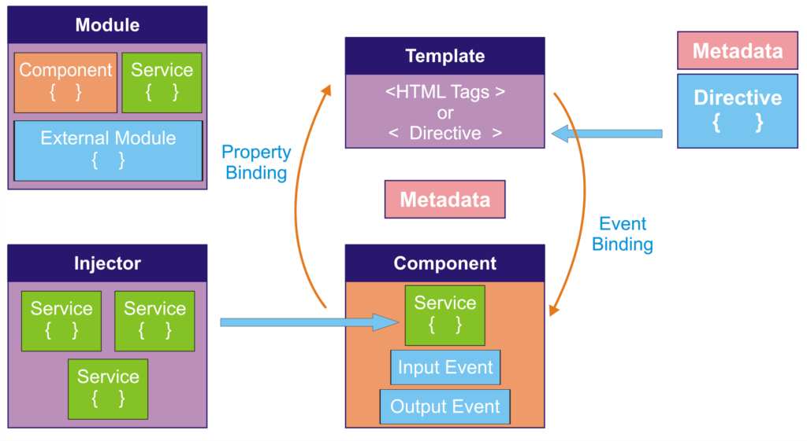

## step 6. app.module.ts, app.component.ts

### 6-1. app.module.ts

- 앵귤러 애플리케이션은 여러 모듈들의 집합.
- 루트 모듈.
- 하위 모듈 임포트.

	>`/bootcamp-2019-base/bootcamp-app/src/main/bootcamp/src/app/app.module.ts`

	```
	import { BrowserModule } from '@angular/platform-browser';
	import { NgModule } from '@angular/core';
	import { AppRoutingModule } from './app-routing.module';
	import { AppComponent } from './app.component';
	import { BrowserAnimationsModule } from '@angular/platform-browser/animations';
	import { ServiceModule, QueryService, GridModule, ChartModule } from 'eediom-sdk';
	import { FormsModule } from '@angular/forms';
	import { CommonModule } from '@angular/common';

	@NgModule({
		declarations: [
			AppComponent,
		],
		imports: [
			BrowserModule,
			AppRoutingModule,
			BrowserAnimationsModule,
			ServiceModule.forRoot({
				productName: 'Araqne'
			}),
			FormsModule,
			GridModule,
			ChartModule,
			CommonModule
		],
		providers: [QueryService],
		bootstrap: [AppComponent]
	})
	export class AppModule { }
	```


### 6-2. app.component.ts

- 클래스 영역에 템플릿 데이터 출력 로직
	>`/bootcamp-2019-base/bootcamp-app/src/main/bootcamp/src/app/app.component.ts`

	```
	import { Component, NgZone, ViewChild } from '@angular/core';
	import { QueryService, SubscribeTypes } from 'eediom-sdk';
	import { GridData, QueryResult, ChartComponent, ChartTypes, LineChartConfigs, Field, Chart } from 'eediom-sdk';
	@Component({
		selector: 'app-root',
		templateUrl: './app.component.html',
		styleUrls: ['./app.component.less'],
	})
	export class AppComponent {
		title: string = 'BOOTCAMP 2019';
		link: string = 'LOGPRESSO';
		@ViewChild('chart', { static: true }) chartComponent: ChartComponent;
		gridData: GridData;
		fieldTypes: QueryResult["fieldTypes"];
		records: QueryResult["records"];
		count: QueryResult["count"];
		chart: Chart;
		query: string = '';
		loading: boolean = false;
		querySuccess: boolean = false;
		isOpen: boolean = false;


		constructor(private queryService: QueryService, private ngZone: NgZone) {
		}

		ngOnInit() :void {
			this.chart = new Chart(ChartTypes.Area, new LineChartConfigs(
				new Field('_time', 'date', '날짜'),
				[
					new Field('Unreal.js', 'int'),
					new Field('billboard.js', 'int'),
					new Field('iotjs', 'int'),
					new Field('metatron-discovery', 'int'),
					new Field('tui.editor', 'int'),
					new Field('veles', 'int'),
				],
				false
			));
			this.chartComponent.render(null, this.chart);
		}

		executeQuery() :void {
			this.querySuccess = false;
			this.loading = true;
			this.queryService.query(this.query, (queryId, subscribeData) => {
				if (subscribeData.type === SubscribeTypes.Eof) {
					this.queryService.getResult(queryId, 100, 0).then((queryResult) => {
						this.ngZone.run(() => {
							this.fieldTypes = queryResult.fieldTypes;
							this.count = queryResult.count;
							this.records = queryResult.records;
							this.onRender();
						})
					})
				}
			});
		}

		columnFiltering(columns:QueryResult["fieldTypes"]):Field[] {
			const tmp = columns.filter((key) => {
				return key.column !== '_id' && key.column !== '_time' && key.column !== '_table';
			}).map((key) => {
				return new Field(key.column, key.type);
			});
			return tmp;
		}

		onRender(): void {
			setTimeout(() => {
				const filteredColumns = this.columnFiltering(this.fieldTypes);
				this.chart = new Chart(
					ChartTypes.Area, 
					new LineChartConfigs(new Field('_time', 'date', '날짜'), filteredColumns, false)
					);

				this.loading = false;
				this.querySuccess = true;
				this.isOpen = true;
				this.chartComponent.update(this.chart, this.records);
				this.gridData = new GridData({
					records: this.records
				})
			}, 1000)
		}

	}
	```

---
### Bootcamp GUIDE LINKS
* [step 1 - 배우는 것들](step1.md)

* [step 2 - createAppProject](step2.md)

* [step 3 - Angular-cli로 프로젝트 생성, 빌드와 루트 path 설정](step3.md)

* [step 4 - 로그프레소 메뉴에 앱 추가하기](step4.md)

* [step 5 - eediom-sdk 설치, 타입스크립트 컴파일 설정](step5.md)

* ### [step 6 - 앵귤러 모듈과 컴포넌트](step6.md)

* [step 7 - 템플릿과 less를 활용한 스타일](step7.md)

* [step 8 - 전체 빌드후 앱에 시나리오 기반 데이터 연동](step8.md)

* [step 9 - 라우터 등록, 컴포넌트를 분리하고 라우팅 구현](step9.md)

* [step 10 - 서비스 구현, 컴포넌트간 값 전달.](step10.md)
