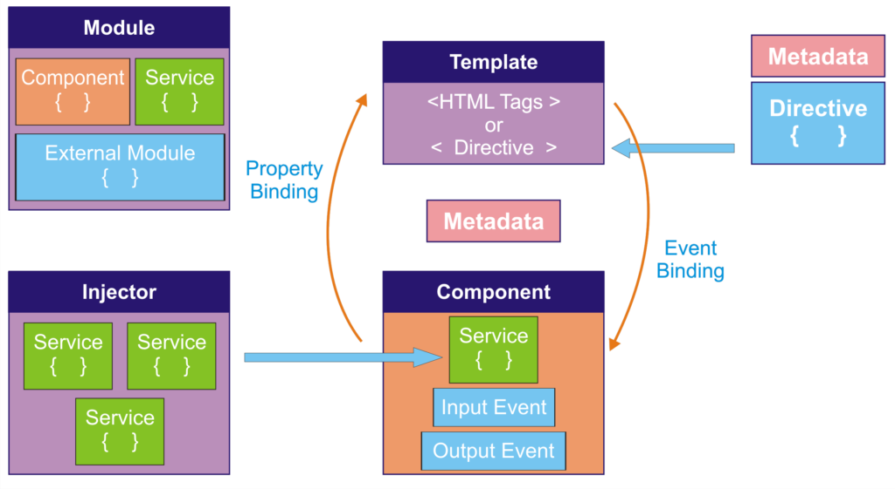

## step 8. app.module.ts, app.component.ts

- app.module.ts

	앵귤러 애플리케이션은 여러 모듈들의 집합.
	
	루트 모듈.

	하위 모듈 임포트.

	>`/bootcamp-2019/bootcamp-app/src/main/bootcamp/src/app/app.module.ts`

	```
	import { BrowserModule } from '@angular/platform-browser';
	import { NgModule } from '@angular/core';
	import { AppRoutingModule } from './app-routing.module';
	import { AppComponent } from './app.component';
	import { BrowserAnimationsModule } from '@angular/platform-browser/animations';
	import { ServiceModule, QueryService } from 'eediom-sdk';
	import { FormsModule } from '@angular/forms';
	@NgModule({
		declarations: [
			AppComponent
		],
		imports: [
			BrowserModule,
			AppRoutingModule,
			BrowserAnimationsModule,
			ServiceModule.forRoot({
				productName: 'Araqne'
			}),
			FormsModule
		],
		providers: [QueryService],
		bootstrap: [AppComponent]
	})
	export class AppModule { }
	```


- app.component.ts

	클래스 영역에 템플릿 데이터 출력 로직
	>`/bootcamp-2019/bootcamp-app/src/main/bootcamp/src/app/app.component.ts`

	```
	import { Component } from '@angular/core';
	import { QueryService } from 'eediom-sdk';
	@Component({
	selector: 'app-root',
	templateUrl: './app.component.html',
	styleUrls: ['./app.component.less']
	})
	export class AppComponent {
		title = 'bootcamp';
		query:string = '';
		result:any = [];
		runQuery:boolean = false;

		constructor(private queryService: QueryService) {
		}

		executeQuery() {
			this.queryService.query(this.query, 100, 0).then((res) => {
			this.result = res.records;
			this.runQuery = true;
			});
		}
	}
	```

---
### Bootcamp GUIDE LINKS
* [step 0 - parser setting](step0.md)
	
* [step 1 - 배우는 것들, createAppProject](step1.md)

* [step 2 - manifest.json](step2.md)

* [step 3 - Angular-cli, ng new](step3.md)

* [step 4 - outputPath, base href](step4.md)

* [step 5 - 로그프레소 메뉴에 앱 추가하기](step5.md)

* [step 6 - eediom-sdk, material-cdk](step6.md)

* [step 7 - tsconfig.json, package.json](step7.md)

* [step 8 - app.module.ts, app.component.ts](step8.md)

* [step 9 - app.component.html](step9.md)

* [step 10 - maven build](step10.md)

* [step 11 - 시나리오 기반 데이터 연동](step11.md)