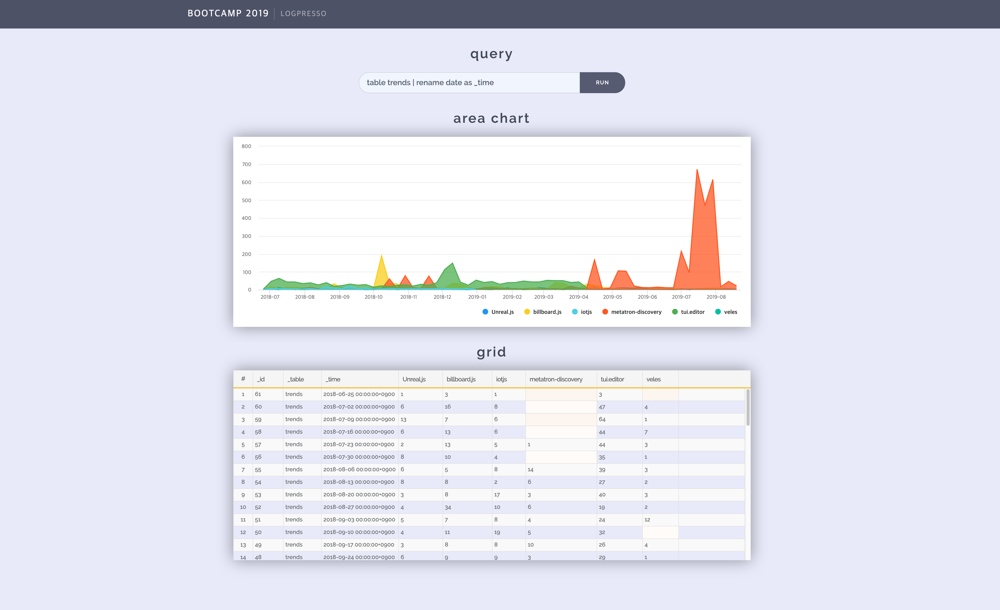

## step 8. 프로젝트 전체 빌드 후 시나리오 기반 데이터 

### 8-1. 메이븐 빌드하기
- pom.xml
	>`/bootcamp-2019/bootcamp-app/`
	<details>
	<summary>pom.xml</summary>
	<div markdown="1">

	```
	<project
		xsi:schemaLocation="http://maven.apache.org/POM/4.0.0 http://maven.apache.org/xsd/maven-4.0.0.xsd"
		xmlns="http://maven.apache.org/POM/4.0.0" xmlns:xsi="http://www.w3.org/2001/XMLSchema-instance">
		<modelVersion>4.0.0</modelVersion>
		<groupId>com.logpresso</groupId>
		<artifactId>bootcamp-app</artifactId>
		<version>1.0.0</version>
		<packaging>bundle</packaging>
		<name>Bootcamp App</name>
		<build>
			<plugins>
				<plugin>
					<groupId>org.apache.maven.plugins</groupId>
					<artifactId>maven-compiler-plugin</artifactId>
					<version>3.3</version>
					<configuration>
						<encoding>UTF-8</encoding>
						<source>8</source>
						<target>8</target>
						<debug>true</debug>
						<optimize>true</optimize>
						<showDeprecations>true</showDeprecations>
					</configuration>
				</plugin>
				<plugin>
					<groupId>org.apache.felix</groupId>
					<artifactId>maven-bundle-plugin</artifactId>
					<version>4.1.0</version>
					<extensions>true</extensions>
					<configuration>
						<instructions>
							<Bundle-SymbolicName>com.logpresso.bootcamp</Bundle-SymbolicName>						
							<Export-Package>
								com.logpresso.bootcamp.app,
								com.logpresso.bootcamp.msgbus
							</Export-Package>
							<Import-Package>
								*
							</Import-Package>
							<Private-Package>
								com.logpresso.bootcamp.command,
								com.logpresso.bootcamp.logger,
								com.logpresso.bootcamp.model,
								com.logpresso.bootcamp.parser,
								com.logpresso.bootcamp.script
							</Private-Package>
						</instructions>
					</configuration>
				</plugin>
				<plugin>
					<groupId>org.apache.felix</groupId>
					<artifactId>maven-ipojo-plugin</artifactId>
					<version>1.12.1</version>
					<executions>
						<execution>
							<goals>
								<goal>ipojo-bundle</goal>
							</goals>
						</execution>
					</executions>
				</plugin>
				<plugin>
					<groupId>com.github.eirslett</groupId>
					<artifactId>frontend-maven-plugin</artifactId>
					<version>1.6</version>
					<configuration>
						<workingDirectory>src/main/bootcamp</workingDirectory>
					</configuration>
					<executions>
						<execution>
							<id>install node and yarn</id>
							<goals>
								<goal>install-node-and-yarn</goal>
							</goals>
							<phase>pre-clean</phase>
							<configuration>
								<nodeVersion>v11.7.0</nodeVersion>
								<yarnVersion>v1.13.0</yarnVersion>
								<downloadRoot>http://staging.araqne.org/nodejs/dist/</downloadRoot>
							</configuration>
						</execution>
						<execution>
							<id>yarn install</id>
							<goals>
								<goal>yarn</goal>
							</goals>
							<configuration>
								<arguments>install --no-optional</arguments>
							</configuration>
						</execution>	
						<execution>
							<id>install dependencies</id>
							<goals>
								<goal>yarn</goal>
							</goals>
							<configuration>
								<arguments>install --ignore-optional --strict-ssl=false --ignore-scripts</arguments>
							</configuration>
						</execution>
						<execution>
							<id>build all</id>
							<goals>
								<goal>yarn</goal>
							</goals>
							<phase>generate-resources</phase>
							<configuration>
								<arguments>run build</arguments>
							</configuration>
						</execution>
					</executions>
				</plugin>
			</plugins>
		</build>
		<repositories>
			<repository>
				<id>splunk-artifactory</id>
				<name>Splunk Releases</name>
				<url>http://splunk.jfrog.io/splunk/ext-releases-local</url>
			</repository>
		</repositories>
		<dependencies>
			<dependency>
				<groupId>org.apache.felix</groupId>
				<artifactId>org.apache.felix.ipojo</artifactId>
				<version>1.10.1</version>
			</dependency>
			<dependency>
				<groupId>org.apache.felix</groupId>
				<artifactId>org.apache.felix.ipojo.annotations</artifactId>
				<version>1.10.1</version>
			</dependency>
			<dependency>
				<groupId>org.slf4j</groupId>
				<artifactId>slf4j-api</artifactId>
				<version>1.7.12</version>
			</dependency>
			<dependency>
				<groupId>org.slf4j</groupId>
				<artifactId>slf4j-simple</artifactId>
				<scope>test</scope>
				<version>1.7.12</version>
			</dependency>
			<dependency>
				<groupId>org.araqne</groupId>
				<artifactId>araqne-log-api</artifactId>
				<version>3.12.7</version>
			</dependency>
			<dependency>
				<groupId>org.araqne</groupId>
				<artifactId>araqne-logdb</artifactId>
				<version>3.9.1-1</version>
			</dependency>
			<dependency>
				<groupId>org.araqne</groupId>
				<artifactId>araqne-confdb</artifactId>
				<version>1.0.2</version>
			</dependency>
			<dependency>
				<groupId>com.splunk</groupId>
				<artifactId>splunk</artifactId>
				<version>1.6.5.0</version>
			</dependency>
			<dependency>
				<groupId>org.araqne</groupId>
				<artifactId>araqne-httpd</artifactId>
				<version>1.6.4</version>
			</dependency>
			<dependency>
				<groupId>org.araqne</groupId>
				<artifactId>araqne-msgbus</artifactId>
				<version>1.12.4</version>
			</dependency>		
			<dependency>
				<groupId>org.araqne</groupId>
				<artifactId>araqne-webconsole</artifactId>
				<version>3.18.1-1</version>
			</dependency>
			<dependency>
				<groupId>org.araqne</groupId>
				<artifactId>araqne-dom</artifactId>
				<version>3.5.4-2</version>
			</dependency>
		</dependencies>
	</project>
	```
	</div>
	</details>

- mvn clean install, bundle.replace

	>`/bootcamp-2019/bootcamp-app/`

	```
	mvn clean install
	bundle.replace 113 file:///Users/mac/Documents/bootcamp-2019/bootcamp-app/target/bootcamp-app-1.0.0.jar
	bundle.refresh
	```

### 8-2. 시나리오 기반 데이터를 앱에 출력

- parse event
	
	```
	localhost:8888
	```
	
	
	```
	table trends | rename date as _time
	```

	
---
### Bootcamp GUIDE LINKS
* [step 1 - 배우는 것들](step1.md)

* [step 2 - createAppProject](step2.md)

* [step 3 - Angular-cli로 프로젝트 생성, 빌드와 루트 path 설정](step3.md)

* [step 4 - 로그프레소 메뉴에 앱 추가하기](step4.md)

* [step 5 - eediom-sdk 설치, 타입스크립트 컴파일 설정](step5.md)

* [step 6 - 앵귤러 모듈과 컴포넌트](step6.md)

* [step 7 - 템플릿과 less를 활용한 스타일](step7.md)

* ### [step 8 - 전체 빌드후 앱에 시나리오 기반 데이터 연동](step8.md)

* [step 9 - 라우터 등록, 컴포넌트를 분리하고 라우팅 구현](step9.md)

* [step 10 - 서비스 구현, 컴포넌트간 값 전달.](step10.md)
