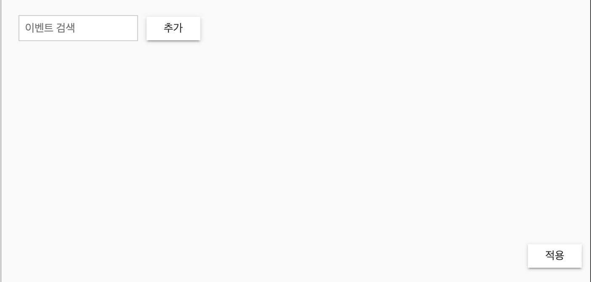

- type 컬럼에 원하는 이벤트를 검색하여 or 조건으로 계속해서 누적해서 추가하는 필터
- 필터2 부분 주석 제거
- 모듈과 컴포넌트 생성 - `ng g m repo-filter && ng g c repo-filter`

---


---


- module에 필요한 모듈을 불러옴
  - icon
  - chips
  - date
  - input
```typescript
// repo-filter.module.ts
import { CommonModule } from '@angular/common';
import { NgModule } from '@angular/core';
import { FormsModule } from '@angular/forms';
import { MatButtonModule } from '@angular/material/button';
import { MatChipsModule } from '@angular/material/chips';
import { MatIconModule } from '@angular/material/icon';
import { InputModule } from 'eediom-sdk';

import { RepoFilterComponent } from './repo-filter.component';

@NgModule({
	declarations: [ RepoFilterComponent ],
	imports: [
		CommonModule,
		FormsModule,
		InputModule,
		MatButtonModule,
		MatChipsModule,
		MatIconModule
	],
	exports: [ RepoFilterComponent ]
})
export class RepoFilterModule {}
```

```less
// repo-filter.component.less
.filter-body {
	height: 60%;
	padding: 10px;

	button {
		margin-left: 10px;
	}

	.time-picker-container {
		display: flex;
		margin-bottom: 10px;
		* + * {
			padding-left: 10px;
		}
	}
}

.filter-footer {
	height: 40%;
	padding: 10px;
	position: relative;
	.search-container {
		position: absolute;
		bottom: 10px;
		right: 0;
	}
}

button {
	overflow: visible;
	color: #333;
	background: #fff;
	border-color: #cecece;
	line-height: 1.4;
	font-size: 13px;
	padding: 5px 7px;
	font-weight: 400;
	border-radius: 0;
}
```

```html
<!-- repo-filter.component.html -->
<div class="filter-body">
	<form>
		<edm-input [(ngModel)]="currentEvent" placeholder="이벤트 검색" [ngModelOptions]="{standalone: true}"></edm-input>
		<button type="submit" mat-raised-button (click)="addEvent(currentEvent)">추가</button>
	</form>
</div>


<div class="filter-footer">
	<div class="apply-filter-container">
		<mat-chip-list>
			<mat-chip *ngFor="let event of eventFilters; let idx = index" (removed)="remove(idx)">{{event}}
				<mat-icon matChipRemove>cancel</mat-icon>
			</mat-chip>
		</mat-chip-list>
	</div>
	<div class="search-container">
		<button mat-raised-button (click)="onApply()">적용</button>
	</div>
</div>
```


```typescript
// repo-filter.component.ts
import { Component, OnInit, Input, Output, EventEmitter } from '@angular/core';
import {
	QueryBuilder,
	LogicalConditionList,
	logicalOpTypes,
	logicalConditions,
	FilteredParams,
	searchQuery
} from 'eediom-sdk';

@Component({
	selector: 'app-repo-filter',
	templateUrl: './repo-filter.component.html',
	styleUrls: [ './repo-filter.component.less' ]
})
export class RepoFilterComponent implements OnInit {
	@Input() queryBuilder: QueryBuilder;
	@Output() changedQueryBuilder: EventEmitter<QueryBuilder> = new EventEmitter<QueryBuilder>();
	eventFilters: string[] = [];

	currentPipe: FilteredParams;

	currentEvent: string;
	constructor() {}

	ngOnInit() {}

	addEvent(event: string): void {
		this.currentEvent = '';

		this.eventFilters.push(event);
		this.updateQueryBuilder();
	}

	remove(index: number): void {
		this.eventFilters.splice(index, 1);

		if (this.eventFilters.length === 0) this.currentPipe.remove();
		else this.updateQueryBuilder();
	}

	updateQueryBuilder(): void {
		if (this.currentPipe) {
			this.currentPipe.remove();
			this.currentPipe = null;
		}

		const parseLogical: LogicalConditionList[] = this.eventFilters.map((event, idx) => ({
			exp: `contains(type, "${event}")`,
			op: idx !== 0 ? logicalOpTypes.Or : null
		}));

		parseLogical.push({
			exp: 'isnotnull(사용자종류)',
			op: logicalOpTypes.Or
		});

		this.currentPipe = this.queryBuilder.pipe(searchQuery(logicalConditions(parseLogical)));
	}

	onApply(): void {
		this.changedQueryBuilder.emit(this.queryBuilder);
	}
}
```